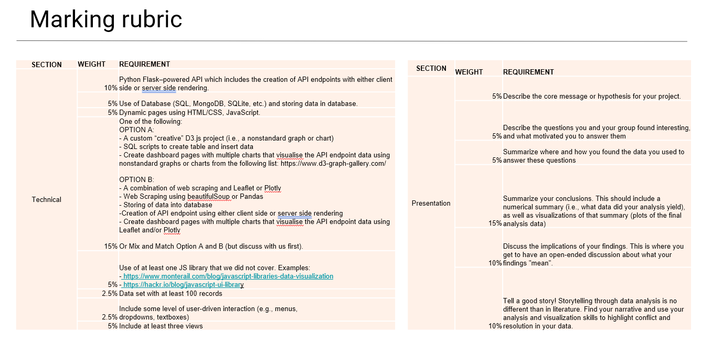

# OVERVIEW OF CRYPTOCURRENCY HISTORICAL DATA (vs SENTIMENT DATA?)

#### **IDEAS**
- Yahoo finance historical data
- Show historical using stock code
- Show moving average
- 30 stocks from 5 different industries
- portfolio theory
- natural language toolkit (extension challenge if time)

- Why? Crypto is a recurring phenomenon. Like to see if any patterns exist. Bitcoin practices, coin cap, halving.

#### **API / ENDPOINTS**
- Volume
- Price

#### **DATABASE**
- SQL

#### **RUBRIC - OPTION A**
- Custom d3.js project
- Refer to rubric

#### **DASHBOARD**

- Overall trend graph of market cap, market value, # of trades

- Users select indivudal codes to display specific coin information

- Can also select family to compare coins and children/forks for analysis.

#### **MEMBERS**
- Anna Dunnett [@github/adunnett](https://github.com/adunnett)
- Connor Lane [@github/Move-7-8](https://github.com/Move-7-8) 
- Gail McGlinn [@github/gmcglinn41](https://github.com/gmcglinn41)
- John Bingley [@github/JB-DA](https://github.com/JB-DA)

#### **TASKS**
- [ ] Readme
- [ ] Directory structure
- [ ] &nbsp;
- [ ] List of countries
- [ ] Population of countries
- [ ] Income group
- [ ] Type of vehicle
- [ ] &nbsp;
- [ ] Collate & clean data
- [ ] Visualise
- [ ] Cleaning Explanation
- [ ] Limitations
- [ ] Finish Powerpoint

